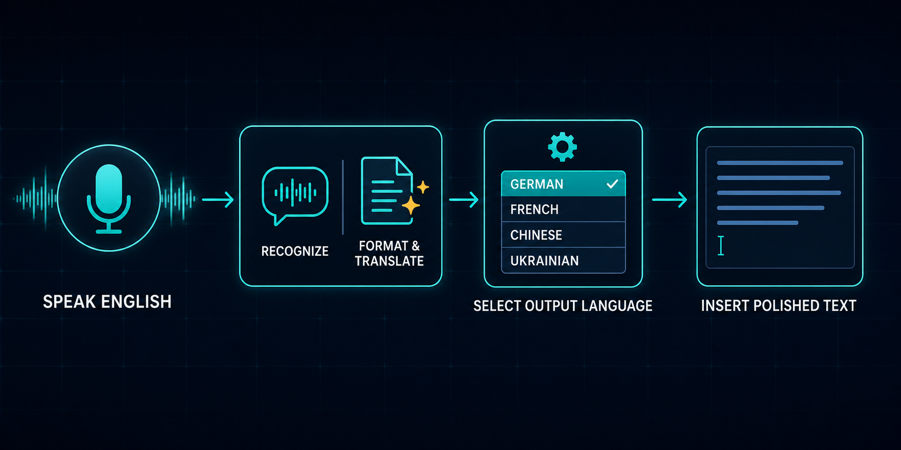

# WisperNext

**Speak in one language. Insert polished text in another.**

WisperNext is a voice dictation and translation app for Windows. Speak naturally in English,
Ukrainian, or another supported language, then insert ready-to-use text in German, French,
Chinese, or any other language selected in Settings.

It combines speech recognition, translation, punctuation, capitalization, paragraph formatting,
and conservative correction of obvious recognition errors in one workflow.



## Two modes

Settings contain two independent options:

- **Spoken language** — the language you speak. Select a fixed language or automatic detection.
- **Final text language** — the language inserted at the cursor.

### Dictation without translation

```text
Spoken language: English
Final text language: Same as spoken language
```

Speak English and receive polished English text.

### Dictation with translation

```text
Spoken language: English
Final text language: German
```

Speak English and receive polished German text. The same workflow can translate Ukrainian into
English, French into Chinese, or any other configured language pair.

## How to use it

1. Place the cursor in a text field.
2. Press `F8` or click the floating microphone button.
3. Speak naturally.
4. Press `F8` or click the button again.
5. WisperNext recognizes, formats, optionally translates, and inserts the result.

`F8` is the default global hotkey. If another application already uses it, the floating button
remains available.

## Features

- separate spoken-language and final-text-language settings;
- same-language formatting or cross-language translation;
- 16 supported languages;
- automatic or manual microphone selection;
- optional automatic paste into the active field;
- floating button and global `F8` hotkey;
- English, Ukrainian, and Russian interface languages;
- secure Groq API-key storage in Windows Credential Manager;
- privacy-safe diagnostics without dictated text, audio, clipboard content, or API keys.

## Requirements

- Windows 10 or Windows 11 — currently tested on Windows 11;
- Python 3.12 or 3.13 (64-bit) — both versions are supported and tested;
- Git;
- a free [Groq API key](https://console.groq.com/keys).

A production installer is not available yet. The current version is installed from source.

## Install from source

Open PowerShell. For every code block below, click its copy button, paste it into PowerShell, and
press Enter.

### 1. Download WisperNext

```powershell
git clone https://github.com/teremno/WisperNext.git
cd WisperNext
```

### 2. Create the Python environment — choose one option only

**Option A — recommended: Python 3.13.** Copy, paste, and run this command first:

```powershell
py -3.13 -m venv .venv
```

If it succeeds, continue to step 3. **Do not run the Python 3.12 command.**

**Option B — use only if Option A says `No suitable Python runtime found`.** Copy, paste, and run:

```powershell
py -3.12 -m venv .venv
```

Python 3.14 and later are not supported yet.

### 3. Install the application

```powershell
.\.venv\Scripts\python.exe -m pip install --upgrade pip
.\.venv\Scripts\python.exe -m pip install -e .
```

When the last line says `Successfully installed wispernext`, installation is complete.

## Get a free Groq API key

1. Open the official [Groq API Keys page](https://console.groq.com/keys).
2. Create a Groq account or sign in. Groq's Free tier lets you create an API key without paying.
3. Click **Create API Key**, give it any name, then copy the new key.
4. Keep the key private. Do not send it to anyone or add it to a file in the project.

## Store the API key safely in Windows

Run these commands one at a time in the same PowerShell window:

```powershell
$secureKey = Read-Host "Enter your Groq API key" -AsSecureString
```

PowerShell now displays `Enter your Groq API key:`. Paste the key you copied, then press Enter.
The characters are hidden on purpose.

```powershell
$env:WISPER_GROQ_API_KEY = [Net.NetworkCredential]::new("", $secureKey).Password
```

```powershell
.\.venv\Scripts\python.exe .\scripts\migrate_groq_key_to_credential_manager.py
```

When PowerShell shows `"status": "stored_and_verified"`, the key is saved safely. Finally run:

```powershell
Remove-Item Env:WISPER_GROQ_API_KEY
```

The key is stored in Windows Credential Manager, not in application settings or diagnostic logs.

## Launch WisperNext

```powershell
.\.venv\Scripts\pythonw.exe -m wispernext
```

Press Enter once. PowerShell does not show a success message; after a few seconds, the floating
microphone button and a system-tray icon appear. You may then close PowerShell. Use the floating
button or `F8`; right-click the button, or use the system-tray icon, to open Settings.

Create a desktop shortcut with:

```powershell
powershell -ExecutionPolicy Bypass -File .\scripts\create_development_shortcut.ps1
```

## Development with an AI Coding Agent

This section is for contributors who want to modify WisperNext. An AI coding agent is not required to install or use the application.

1. Clone the repository.
2. Open the cloned `WisperNext` folder in an AI coding agent that can work with local files and Git.
3. Start a new task and send this instruction:

```text
Start with AGENT_START_PROMPT.md
```

## Feedback and ideas

Feature requests, additional-language requests, bug reports, and new ideas are welcome. Contact
the author on X: **[S.O.V (@sovpoker)](https://x.com/sovpoker)**.

I am open to user feedback and will gladly consider useful requests whenever they are technically
possible and fit the project.

## Author

Created by **Oleksandr Smuryhin** in collaboration with OpenAI Codex.

WisperNext was built to remove the need to switch between separate dictation, translation, and
text-editing tools: speak naturally and receive polished text in the language you need.

Licensed under the [MIT License](LICENSE).
**
